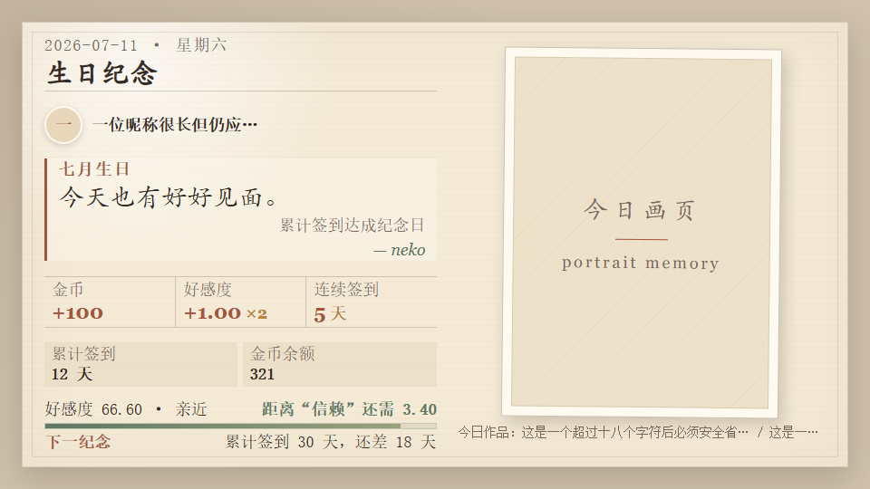

<div align="center">

# 画境拾珍

一个面向 AstrBot 的 Pixiv 发图插件：搜索插画、查看排行榜、下载作品、每日签到，并在 WebUI 管理图片历史与黑名单。


</div>

## 界面展示

### 签到卡片



> 签到卡片采用固定 `960 × 540` 的“H · 丰富信息纸张画册”布局；上图为真实模板预览，测试命令不会写入签到数据。

### 签到功能帮助


发送 `/签到帮助` 可直接获取这张静态帮助图，不依赖 T2I 渲染。

## 功能一览

| 场景 | 能力 |
| --- | --- |
| 搜图发图 | 按标签搜索 Pixiv 插画，支持数量限制、多页作品、原图自动降级 |
| 排行榜 | 支持日榜、周榜、月榜、男性向、女性向、原创、新人、漫画 8 种榜单 |
| 作品工具 | 查询作品详情，通过作品 ID 下载并发送指定页 |
| 内容过滤 | R18 模式、漫画过滤、标签黑名单、作品 ID 黑名单 |
| 每日签到 | H 纸张画册卡片、严格竖向 Pixiv 作品、金币、好感度、连续签到、加持商店 |
| WebUI 历史 | 查看已发送图片、本地缩略图、Pixiv 链接，并管理作品黑名单 |
| AI 评论 | 可选视觉模型识图，再由文本模型生成一句插画评论 |
| 稳定性 | 请求频率限制、当天去重、发送失败重试、临时文件自动清理 |

> 主要面向 QQ OneBot / aiocqhttp。其他平台会按 AstrBot 能力尽量降级为逐条发送，兼容性请自行测试。

## 快速开始

1. 在 AstrBot WebUI 插件页安装本插件：
   - 下载本仓库 zip 后选择「导入压缩包」
   - 或在插件安装页粘贴仓库地址：`https://github.com/shitianyaa/astrbot_plugin_get_px`
2. 安装完成后进入插件配置，填写 `pixiv_refresh_token`。
3. 如访问 Pixiv 需要代理，填写 `pixiv_proxy_url`，例如 `http://127.0.0.1:7890`。
4. 发送 `/ph` 查看帮助，或直接试试：

```text
/p 初音ミク 3
/pr week 3
/签到
```

> [!IMPORTANT]
> **关于 T2I 渲染服务**
>
> 本插件依赖 AstrBot 的 T2I（HTML 转图片）功能生成签到卡片。由于公共 T2I 服务的节点在国外，第三方公共 T2I 服务通常有请求大小限制或 SSL 连接问题，**强烈建议自建 T2I 服务**以获得最佳体验。
>
> - 自部署文档：[AstrBot T2I 服务部署指南](https://docs.astrbot.app/others/self-host-t2i.html)

## 常用指令

| 指令 | 说明 | 示例 |
| --- | --- | --- |
| `/p [标签] [数量]` | 按标签搜索并发送图片 | `/p 初音ミク 3` |
| `/p [数量]` | 无标签时拉取默认排行榜 | `/p 5` |
| `/pr [类型] [数量]` | 获取指定排行榜 | `/pr week 3` |
| `/prl` | 查看全部排行榜类型 | `/prl` |
| `/pi <作品ID>` | 查看作品详情 | `/pi 12345678` |
| `/pd <作品ID> [页码]` | 下载并发送作品图片 | `/pd 12345678 2` |
| `/签到` | 每日签到并发送签到卡片 | `/签到` |
| `/签到帮助` | 发送完整签到功能帮助图片 | `/签到帮助` |
| `/签到测试` | 使用当前用户资料和问候配置预览卡片，不写入数据 | `/签到测试` |
| `/签到状态` | 查看累计签到、金币、好感度和加持状态 | `/签到状态` |
| `/签到商店` | 查看好感度加持商品 | `/签到商店` |
| `/购买加持 <天数>` | 购买好感度双倍加持，支持 1/3/7 天 | `/购买加持 3` |
| `/签到生日` | 查看生日；未保存时自动读取 QQ 资料 | `/签到生日` |
| `/签到生日 设置 MM-DD` | 手动设置签到生日 | `/签到生日 设置 07-11` |
| `/签到生日 清除` | 清除已保存的签到生日 | `/签到生日 清除` |
| `/签到成就` | 查看已解锁成就和下一目标 | `/签到成就` |
| `/签到称号` | 查看已解锁称号 | `/签到称号` |
| `/佩戴称号 <ID或名称>` | 切换卡片称号 | `/佩戴称号 七日同行` |
| `/签到事件 ...` | 管理员维护年度或单次全局事件 | `/签到事件 添加年度 07-11 相遇纪念日` |
| `/ph` | 查看插件帮助 | `/ph` |

## 自然语言触发

开启 `auto_trigger_enabled` 后，可以不带命令前缀触发搜图。

| 触发语 | 效果 |
| --- | --- |
| `来一份图` | 发送 1 张默认排行榜图片 |
| `来三张初音ミク图` | 搜索「初音ミク」并发送 3 张 |
| `来两张萝莉图` | 搜索「萝莉」并发送 2 张 |
| `来张风景图` | 搜索「风景」并发送 1 张 |
| `签到` | 触发每日签到 |

## WebUI 图片历史

插件会在 AstrBot WebUI 插件页提供「图片历史」页面。

- 记录搜索、排行榜、作品下载和签到 Pixiv 背景中成功发送的图片。
- 保存标题、作者、作品 ID、页码、来源、R18 标记、尺寸、会话、发送时间、文件大小和 Pixiv 链接。
- 只保留本地缩略图和元数据，不保存原始发送图片。
- 默认最多保留最近 200 条记录，超过后自动清理旧记录和对应缩略图。
- 可在页面中把作品加入黑名单；黑名单会影响搜索、排行、签到背景、详情和下载。

## 每日签到

签到数据按用户全局统计。同一用户每天只能成功签到一次，首次签到会获得金币和好感度，连续签到会提高奖励。

| 行为 | 规则 |
| --- | --- |
| 首次签到 | 发放金币和好感度，生成签到卡片 |
| 连续签到 | 连续天数增加，奖励随连续天数提升 |
| 漏签 | 连续天数重置为 1，累计签到天数不清零 |
| 重复签到 | 不重复发奖、不扣好感度，重新发送当天已保存的同一张卡片 |
| 签到测试 | 使用当前用户资料、生日、称号、事件和问候配置预览卡片；Pixiv 背景在 5 分钟内避免重复，但不发奖、不增加签到次数，也不写入图片历史或正式去重索引 |

### 加持商店

| 商品 | 价格 |
| --- | --- |
| 好感度双倍加持 1 天 | 200 金币 |
| 好感度双倍加持 3 天 | 500 金币 |
| 好感度双倍加持 7 天 | 1000 金币 |

加持购买后立即记录有效期。如果当天已经签到，则从明天签到开始影响收益；重复购买会延长有效期。

### 好感度等级

| 好感度 | 等级 |
| --- | --- |
| `< 0` | 排斥 |
| `0 - 9.99` | 陌生 |
| `10 - 29.99` | 熟悉 |
| `30 - 69.99` | 亲近 |
| `70 - 139.99` | 信赖 |
| `140+` | 挚友 |

签到卡片固定渲染为 `960 × 540` 的 H 纸张画册：左侧展示身份、问候、今日奖励和成长进度，右侧使用固定 `3:4` 相框。Pixiv 作品按 `3:4 ± 20%` 严格筛选，只接受宽高比 `0.60–0.90`；签到背景固定下载 Pixiv `medium` 画质，不受普通发图画质配置影响，也不会先下载原图再降级。当前页无匹配时继续翻页，不会改用横图或方图。作品下载失败、损坏或所有分页都无匹配时，相框显示内置纸张占位图，图片始终使用 `object-fit: contain` 完整展示，不裁切原图。

首次签到生成的问候、作品信息和最终 JPEG 会保存供当天复用。重复签到不再扣除好感度，也不会重新发奖、重新选图或再次调用问候模型，而是优先重发同一张缓存卡片；JPEG 缓存仅保留一天，缺失或损坏时根据当天记录重建。

法定节假日与调休数据来自 `holiday-cn` 年度数据，并保存在 AstrBot 插件数据目录。插件首次安装、插件版本变化时会在后台尝试更新一次；正常运行期间距上次成功更新满 `180` 天后再次更新。网络失败不会阻塞插件启动或签到，会继续使用旧缓存，并由内置公历日期和 `lunar-python` 农历节日规则兜底。每次更新会预取当前年份和下一年份的数据。

签到问候可选择本地事件文案、[一言 API](https://developer.hitokoto.cn/sentence/) 或 AstrBot 文本模型，默认使用一言。AI 模式可单独选择文本模型；未指定时尝试当前会话文本模型。一言正文限制为最多 24 个字符，每位用户当日首次签到仅请求一次，句子和卡片会随当日签到记录复用；API 超时、报错、返回空文本、超长或内容不合规时，均回退到对应事件的本地文案，不影响奖励和卡片发送。

生日只保存月日，不保存出生年份。首次签到会在 OneBot QQ 平台尝试一次资料读取；直接使用 `/签到生日` 可查看生日，并在尚未保存时重新读取 QQ 资料。QQ 资料未公开时会给出提示，用户也可以手动设置或清除生日。管理员可以添加插件全局年度事件和单次事件。主事件按“生日、单次事件、年度事件、节假日、签到里程碑、连续签到”排序，其他同日事件进入次要备注。

累计签到和连续签到会解锁称号：初见旅人、七日同行、月下常客、百日珍藏、周年相守和千日物语。老用户在下一次签到、查看成就或查看称号时会按当前数据补发已满足的称号；尚未佩戴称号时自动佩戴当前已解锁的最高称号，之后可用 `/佩戴称号` 自行切换。

## 排行榜类型

| 类型 | 含义 | 说明 |
| --- | --- | --- |
| `day` | 今日排行榜 | 每日综合排名 |
| `week` | 本周排行榜 | 默认榜单，作品质量稳定 |
| `month` | 本月排行榜 | 每月综合排名 |
| `day_male` | 男性向日榜 | 男性用户偏好的每日排名 |
| `day_female` | 女性向日榜 | 女性用户偏好的每日排名 |
| `week_original` | 原创周榜 | 原创作品的每周排名 |
| `week_rookie` | 新人周榜 | 新注册作者的每周排名 |
| `day_manga` | 漫画日榜 | 漫画或多页作品的每日排名 |

## 推荐配置

| 配置 | 建议 |
| --- | --- |
| `pixiv_refresh_token` | 必填，没有 token 插件无法请求 Pixiv |
| `pixiv_proxy_url` | 访问 Pixiv 不稳定时填写代理 |
| `pixiv_r18` | 群聊建议保持 `0`，即仅非 R18 |
| `image_quality` | 想省流量用 `large`，想优先原图用 `original` |
| `send_as_forward` | QQ 场景建议开启，多图会以合并转发发送 |
| `checkin_card_quality` | 推荐 `95`；文字仍显模糊时可提高到 `97–100` |
| `dedupe_ttl_hours` | 保持默认即可，同群同标签当天尽量不重复 |
| `auto_trigger_enabled` | 想让「来张图」生效时再开启 |
| `ai_enabled` | AstrBot 已配置视觉模型和文本模型后再开启 |

<details>
<summary>完整配置项</summary>

| 配置 | 说明 | 默认值 |
| --- | --- | --- |
| `pixiv_refresh_token` | Pixiv refresh_token，必填 | 空 |
| `pixiv_proxy_url` | 代理地址，支持 `http://`、`socks5://` | 空 |
| `pixiv_r18` | R18 模式：`0` 仅非 R18，`1` 仅 R18，`2` 混合 | `0` |
| `filter_manga` | 过滤漫画作品；主动请求 `day_manga` 时保留后门 | `true` |
| `blacklist_tags` | 拉黑标签，多个标签可用逗号、顿号、分号或换行分隔；留空会回退默认拉黑标签 | `furry,裸体,全裸,触手,露出,nsfw` |
| `pixiv_ranking_mode` | 无标签时使用的默认排行榜类型 | `week` |
| `max_count` | 单次最大发送数量，范围 1-20 | `5` |
| `dedupe_ttl_hours` | 普通发图当天去重；设为 `0` 关闭普通发图去重；当前按自然日去重，不按小时滚动过期 | `24` |
| `request_timeout` | 单张图片下载超时，单位秒 | `30` |
| `image_quality` | 图片质量：`original`、`large`、`medium` | `original` |
| `auto_downgrade_original_mb` | 原图超过该大小时自动降级，单位 MiB；`0` 为禁用 | `3.0` |
| `send_as_forward` | 多图以合并转发发送；非 QQ 平台不支持时自动逐条发送 | `true` |
| `auto_trigger_enabled` | 自然语言自动触发 | `false` |
| `checkin_enabled` | 签到开关 | `true` |
| `checkin_bot_name` | 签到卡片中的 bot 角色名 | `neko` |
| `checkin_background_mode` | 签到背景模式：`pixiv_daily` 或 `custom`；自定义背景不可用时会继续尝试 Pixiv 背景 | `pixiv_daily` |
| `checkin_background_tag` | 签到 Pixiv 背景标签，多个标签可用逗号、顿号、分号或换行分隔；每次随机确定尝试顺序，一个标签无可用候选时继续尝试下一个 | 空 |
| `checkin_background_aspect_ratio` | V2 固定使用 `3:4` 竖向作品；该项仅保留用于配置兼容 | `3:4` |
| `checkin_background_aspect_tolerance` | V2 固定容差 `0.20`，接受宽高比 `0.60–0.90`；不会放宽到其他比例 | `0.20` |
| `checkin_custom_background` | 本地图片路径；V2 仍按竖向作品相框完整显示 | 空 |
| `checkin_avatar_enabled` | 签到卡片显示用户头像 | `true` |
| `checkin_card_quality` | 签到卡片 JPEG 清晰度，范围 60–100；修改后自动生成新的当天缓存 | `95` |
| `checkin_greeting_mode` | 签到问候来源：`local` / `hitokoto` / `ai` | `hitokoto` |
| `checkin_ai_greeting_provider_id` | 签到问候文本模型；留空时尝试当前会话文本模型 | 空 |
| `checkin_ai_greeting_prompt` | 签到问候提示词，使用 `{checkin_data}` 注入受控数据 | 见配置页 |
| `checkin_ai_greeting_timeout` | 单次问候模型调用超时秒数；失败后回退本地文案 | `8.0` |
| `checkin_hitokoto_timeout` | 一言 API 请求超时秒数；失败后回退本地文案 | `5.0` |
| `rate_limit_seconds` | 同一用户请求频率限制，单位秒；`0` 为禁用 | `3` |
| `ai_enabled` | AI 识图评论开关 | `false` |
| `ai_probability` | AI 识图触发概率，范围 0-100 | `30` |
| `ai_max_images` | 每次最多分析的图片数量 | `3` |
| `ai_pre_message` | AI 识图前发送的提示消息 | `让我先品鉴一番，你稍等喵~` |
| `ai_vision_provider_id` | 视觉模型 ID，留空时自动选择 | 空 |
| `ai_comment_provider_id` | 评论模型 ID，留空时使用当前会话模型 | 空 |
| `ai_vision_prompt` | 发送给视觉模型的提示词 | 见配置页 |
| `ai_comment_prompt` | 评论模型提示词，使用 `{description}` 注入识图结果 | 见配置页 |
| `webui_font_source` | WebUI 字体来源：`mirror`、`official`、`none` | `mirror` |

</details>

## 数据与清理

- 当天去重使用 SQLite 记录，同一群聊或私聊内，同一标签或排行榜当天尽量不重复。
- 签到 Pixiv 背景会同时参考当天 SQLite 索引和图片历史；正式签到会预占用索引，失败时释放占用，当前页候选全用过时自动翻页。
- 图片历史和黑名单保存在 AstrBot 插件数据目录中。
- 发送用原图或大图是临时文件，发送完成后会自动清理。
- 图片历史删除或加入黑名单不会清空当天已发作品索引。

## 开发与架构

项目已按签到、Pixiv、Web API 和 Plugin Pages 前端拆分，模块职责与依赖方向见 [项目架构](docs/project/architecture.md)。

## 获取 Pixiv Token

可以使用 [pixiv-token](https://github.com/shitianyaa/pixiv-token) 获取 Pixiv `refresh_token`，然后填入插件配置的 `pixiv_refresh_token`。

## 依赖

```text
pixivpy-async
aiohttp
Pillow
```

## 致谢

- Pixiv 图片获取基于 [pixivpy-async](https://github.com/Mikubill/pixivpy-async)
- 历史缩略图生成基于 [Pillow](https://python-pillow.org/)
- 签到每日一言由 [Hitokoto API](https://github.com/hitokoto-osc/hitokoto-api) 提供，感谢一言开源社区和公共 API 服务
- 每日签到设计参考 [zhenxun_bot](https://github.com/zhenxun-org/zhenxun_bot)
