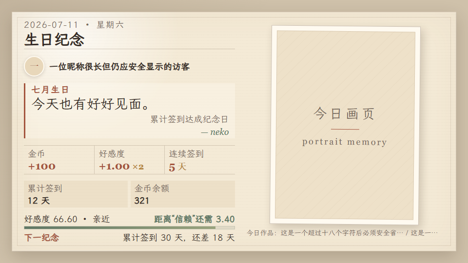
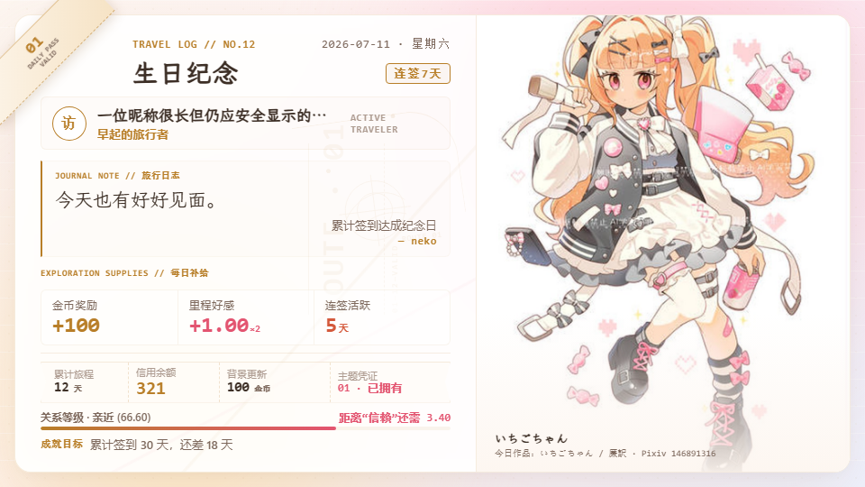
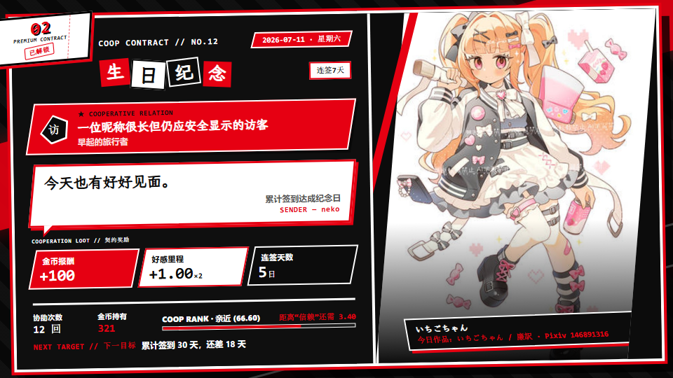
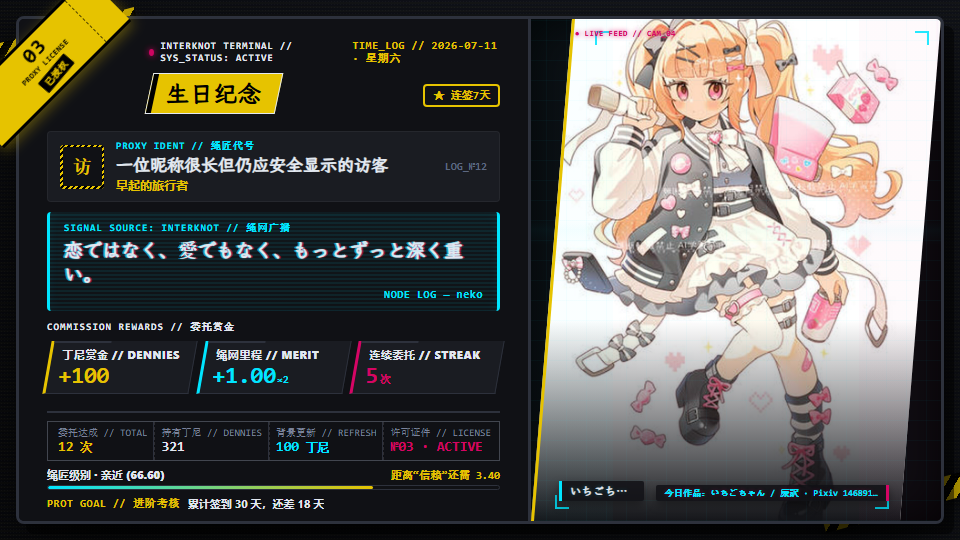
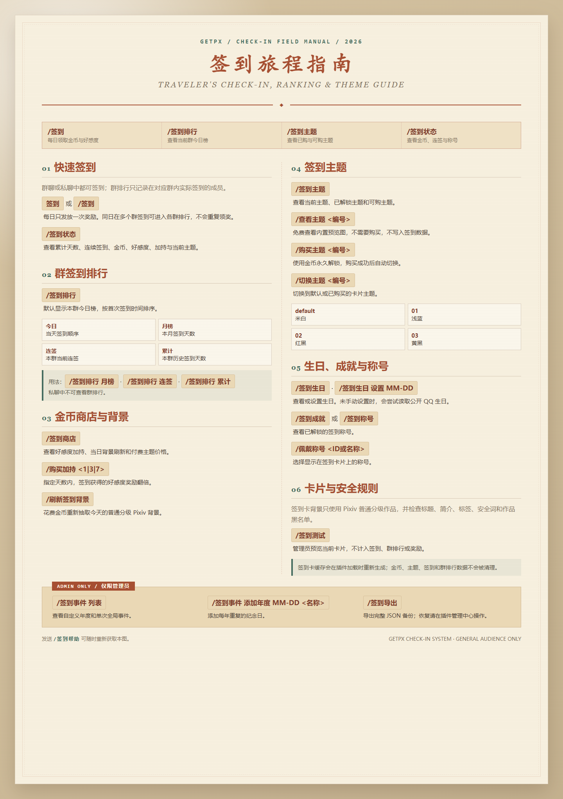

<div align="center">

# 画境拾珍

一个面向 AstrBot 的 Pixiv 发图插件：安全搜索普通分级插画、查看排行榜、下载作品、每日签到，并在 WebUI 管理群排行、成员数值、内容安全和签到数据。


</div>

## 目录

- [界面展示](#界面展示)
- [功能一览](#功能一览)
- [快速开始](#快速开始)
- [常用指令](#常用指令)
- [自然语言触发](#自然语言触发)
- [WebUI](#webui-插件管理中心)
- [每日签到](#每日签到)
- [推荐配置](#推荐配置)
- [更多文档](#更多文档)

## 界面展示

| `00` · 米白 | `01` · 浅蓝 |
| :---: | :---: |
|  |  |
| `02` · 红黑 | `03` · 黄黑 |
|  |  |

签到卡 `960 × 540`。`/查看主题 <编号>` 可免费看预览（如 `/查看主题 1`），不扣金币、不切换主题。



发送 `/签到帮助` 获取静态帮助图，不依赖 T2I。

## 功能一览

| 场景 | 能力 |
| --- | --- |
| 搜图发图 | 按标签搜索 Pixiv 插画，支持数量限制、多页作品、原图自动降级 |
| 排行榜 | 日/周/月、男性向、女性向、原创、新人、漫画 8 种榜单 |
| 作品工具 | 查询详情，按作品 ID 下载指定页 |
| 内容安全 | 强制普通分级、内置安全词（不可关）、自定义安全词、作品 ID 黑名单 |
| 每日签到 | H 纸张画册卡片、竖向 Pixiv 背景、金币、好感度、连签、商店与主题 |
| 管理中心 | 群排行与趋势、成员数值、安全词与黑名单、签到备份 |
| 稳定性 | 频率限制、当天去重、发送失败重试、临时文件自动清理 |

> 主要面向 QQ OneBot / aiocqhttp。其他平台会尽量降级为逐条发送，请自行测试兼容性。

## 快速开始

1. 在 AstrBot WebUI 插件页安装本插件：
   - 下载本仓库 zip 后选择「导入压缩包」
   - 或粘贴仓库地址：`https://github.com/shitianyaa/astrbot_plugin_get_px`
2. 填写 `pixiv_refresh_token`（[如何获取](#获取-pixiv-token)）。
3. 需要代理时填写 `pixiv_proxy_url`，例如 `http://127.0.0.1:7890`。
4. 发送 `/ph` 查看帮助，或直接试试：

```text
/p 初音ミク 3
/pr week 3
/签到
```

> [!WARNING]
> **跨版本升级与签到数据**
>
> 从旧版本直接升级后如果发现签到数据缺失，请先安装 [v3.0.0](https://github.com/shitianyaa/astrbot_plugin_get_px/releases/tag/v3.0.0)，启动插件一次并确认旧签到数据迁移完成，再升级到最新版本。操作前请备份 AstrBot 插件数据目录中的 `checkin.sqlite3` 和 `checkin_backups/`，不要删除或覆盖原数据目录。

> [!IMPORTANT]
> **关于 T2I 渲染服务**
>
> 签到卡片依赖 AstrBot T2I（HTML 转图片）。公共 T2I 常有海外节点、体积限制或 SSL 问题，**强烈建议自建**。
>
> - 自部署文档：[AstrBot T2I 服务部署指南](https://docs.astrbot.app/others/self-host-t2i.html)

## 常用指令

| 指令 | 说明 | 示例 |
| --- | --- | --- |
| `/p [标签] [数量]` | 按标签搜索发图 | `/p 初音ミク 3` |
| `/p [数量]` | 无标签时拉默认排行榜 | `/p 5` |
| `/pr [类型] [数量]` | 指定排行榜（默认类型 `week`，全部见 `/prl`） | `/pr week 3` |
| `/prl` | 全部排行榜类型 | `/prl` |
| `/pi <作品ID>` | 作品详情 | `/pi 12345678` |
| `/pd <作品ID> [页码]` | 下载并发送 | `/pd 12345678 2` |
| `/签到` | 每日签到 | `/签到` |
| `/签到帮助` | 签到帮助图 | `/签到帮助` |
| `/签到状态` | 金币、好感、连签等 | `/签到状态` |
| `/签到商店` | 加持、背景刷新、主题 | `/签到商店` |
| `/签到主题` | 当前/已购/可购主题 | `/签到主题` |
| `/查看主题 <编号>` | 免费主题预览 | `/查看主题 1` |
| `/ph` | 插件帮助 | `/ph` |

完整指令（含商店购买、生日、成就、管理员事件/导出等）见 [指令参考](docs/user/commands.md)。

## 自然语言触发

开启 `auto_trigger_enabled` 后可不带命令前缀触发：

| 触发语 | 效果 |
| --- | --- |
| `来一份图` | 1 张默认排行榜图 |
| `来三张初音ミク图` | 搜索并发送 3 张 |
| `来两张萝莉图` | 搜索并发送 2 张 |
| `来张风景图` | 搜索并发送 1 张 |
| `签到` | 每日签到 |

## WebUI 插件管理中心

AstrBot WebUI 插件页的「pluginCenter」可：

- 按群查看今日 / 月度 / 连签 / 累计排行与 7/30 天趋势
- 搜索成员并调整金币、好感度、累计与连续签到当前值
- 维护自定义屏蔽词与作品 ID 黑名单
- 下载 / 上传签到备份（schema v6，仅接受当前版本 JSON）

成员数值编辑只改当前资料，不回写历史奖励、群排行或已生成卡片。

## 每日签到

- 奖励全局一天一次；群榜按实际签到的群分别记录，不重复发金币。
- 重复签到不重奖，重发当天缓存卡片。
- 商店：加持 200/500/1000；背景刷新默认 100（可配）；非默认主题每套 1500。默认「米白」免费。

细则（好感等级、卡片规格、问候 24/32 字、生日事件、称号、节假日等）见 [签到说明](docs/user/checkin.md)。

## 推荐配置

| 配置 | 建议 |
| --- | --- |
| `pixiv_refresh_token` | 必填 |
| `pixiv_proxy_url` | Pixiv 不稳定时填代理 |
| `image_quality` | 省流量用 `large`，优先原图用 `original` |
| `send_as_forward` | QQ 场景建议开启 |
| `checkin_card_quality` | 推荐 `95`；文字糊可提到 `97–100` |
| `dedupe_ttl_hours` | 默认即可，同群同标签当天尽量不重复 |
| `auto_trigger_enabled` | 需要「来张图」时再开 |

<details>
<summary>完整配置项</summary>

| 配置 | 说明 | 默认值 |
| --- | --- | --- |
| `pixiv_refresh_token` | Pixiv refresh_token，必填 | 空 |
| `pixiv_proxy_url` | 代理地址，支持 `http://`、`socks5://` | 空 |
| `filter_manga` | 过滤漫画作品；主动请求 `day_manga` 时保留后门 | `true` |
| `pixiv_ranking_mode` | 无标签时使用的默认排行榜类型 | `week` |
| `max_count` | 单次最大发送数量，范围 1-20 | `5` |
| `dedupe_ttl_hours` | 普通发图当天去重；范围 `0–24`，设为 `0` 关闭；当前按自然日去重，不按小时滚动过期 | `24` |
| `request_timeout` | 单张图片下载超时，单位秒 | `30` |
| `image_quality` | 图片质量：`original`、`large`、`medium` | `original` |
| `auto_downgrade_original_mb` | 原图超过该大小时自动降级，单位 MiB；`0` 为禁用 | `3.0` |
| `send_as_forward` | 多图以合并转发发送；非 QQ 平台不支持时自动逐条发送 | `true` |
| `auto_trigger_enabled` | 自然语言自动触发 | `false` |
| `checkin_enabled` | 签到开关 | `true` |
| `checkin_bot_name` | 签到卡片中的 bot 角色名 | `neko` |
| `checkin_background_mode` | 签到背景模式：`pixiv_daily` 或 `custom`；自定义背景不可用时会继续尝试 Pixiv 背景 | `pixiv_daily` |
| `checkin_background_refresh_cost` | 用户更新当天 Pixiv 签到背景所需金币；范围 `0–500`，`0` 为免费 | `100` |
| `checkin_background_tag` | 签到 Pixiv 背景标签，多个标签可用逗号、顿号、分号或换行分隔；每次随机确定尝试顺序，一个标签无可用候选时继续尝试下一个 | 空 |
| `checkin_custom_background` | 本地图片路径；默认主题按竖向作品相框完整显示 | 空 |
| `checkin_avatar_enabled` | 签到卡片显示用户头像 | `true` |
| `checkin_card_quality` | 签到卡片 JPEG 清晰度，范围 60–100；修改后自动生成新的当天缓存 | `95` |
| `checkin_greeting_mode` | 签到问候来源：`local` / `hitokoto` / `ai` | `hitokoto` |
| `checkin_hitokoto_categories` | 一言类型中文多选；选择“全部”或留空时从全部分类随机 | `全部` |
| `checkin_ai_greeting_provider_id` | 签到问候文本模型；留空时尝试当前会话文本模型 | 空 |
| `checkin_ai_greeting_prompt` | 签到问候提示词，使用 `{checkin_data}` 注入受控数据 | 见配置页 |
| `checkin_ai_greeting_timeout` | 单次问候模型调用超时秒数；失败后回退本地文案 | `8.0` |
| `checkin_hitokoto_timeout` | 一言 API 请求超时秒数；失败后回退本地文案 | `5.0` |
| `rate_limit_seconds` | 同一用户请求频率限制，单位秒；`0` 为禁用 | `3` |
| `webui_font_source` | WebUI 字体来源：`mirror`、`official`、`none` | `mirror` |

</details>

## 更多文档

| 文档 | 内容 |
| --- | --- |
| [指令参考](docs/user/commands.md) | 全部指令、排行榜类型、自然语言 |
| [签到说明](docs/user/checkin.md) | 发奖、商店、好感、卡片、问候、生日事件与称号 |
| [项目架构](docs/project/architecture.md) | 模块划分（开发用） |

**数据简述：** 发图当天去重与签到数据在插件数据目录；发送用临时图发完即清；签到 JPEG 缓存按天自过期，不会整目录清空数据库、黑名单或备份。

## 获取 Pixiv Token

使用 [piglig/pixiv-token](https://github.com/piglig/pixiv-token) 获取 `refresh_token`，填入 `pixiv_refresh_token`。该工具基于 Playwright 自动完成 Pixiv OAuth 登录并取回 token，按仓库说明运行即可。

## 依赖

```text
pixivpy-async
aiohttp
Pillow
lunar-python
```

## 致谢

- Pixiv 图片获取基于 [pixivpy-async](https://github.com/Mikubill/pixivpy-async)
- Pixiv `refresh_token` 获取方案来自 [piglig/pixiv-token](https://github.com/piglig/pixiv-token)，感谢 [piglig](https://github.com/piglig) 提供基于 Playwright 的 OAuth 自动取码工具
- 作品黑名单缩略图生成基于 [Pillow](https://python-pillow.org/)
- 签到每日一言由 [Hitokoto API](https://github.com/hitokoto-osc/hitokoto-api) 提供，感谢一言开源社区和公共 API 服务
- 签到卡片内置字体由 [霞鹜文楷轻便版](https://github.com/lxgw/LxgwWenKai-Lite) 生成，采用 SIL Open Font License 1.1 授权
- 每日签到设计参考 [zhenxun_bot](https://github.com/zhenxun-org/zhenxun_bot)
