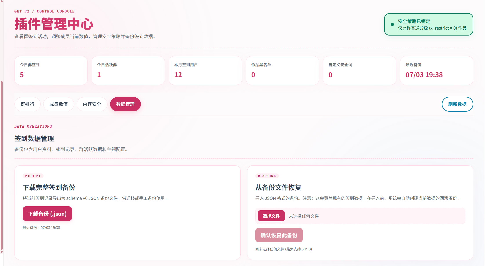

<div align="center">

# 画境拾珍


一个面向 AstrBot 的安全发图与签到插件：Lolicon 优先取图，失败时可用 Pixiv refresh_token 回退，并在 WebUI 管理群排行、成员数值、内容安全和签到数据。


<br>


</div>

## 目录

- [界面展示](#界面展示)
- [功能一览](#功能一览)
- [快速开始](#快速开始)
- [常用指令](#常用指令)
- [自然语言触发](#自然语言触发)
- [WebUI](#webui-插件管理中心)
- [每日签到](#每日签到)
- [推荐配置](#推荐配置)
- [更多文档](#更多文档)
- [Roadmap](#roadmap)
- [贡献指南](#贡献指南)

## 界面展示

### 签到卡主题

| `04` · 新柳 | `05` · 荷风 |
| :---: | :---: |
|  |  |
| `06` · 丹枫 | `07` · 寒梅 |
|  |  |

签到卡支持 `省流量`（960×540）、`清晰`（1248×702）和 `极致`（1728×972）三档。`/签到主题 查看 <编号>` 可免费看预览（如 `/签到主题 查看 1`），不扣金币、不切换主题。

### WebUI 管理中心

<div align="center">

</div>

<br>

插件管理中心提供群排行与趋势图表、成员数值编辑、内容安全管理和签到数据备份功能，所有操作均通过可视化界面完成。

## 功能一览

| 场景 | 能力 |
| --- | --- |
| 搜图发图 | Lolicon 标签搜索或随机取图，失败时回退 Pixiv 搜索/推荐，支持数量限制与原图自动降级 |
| 图片来源 | Lolicon 为首选；`pixiv_refresh_token` 可选，仅作回退 |
| 内容安全 | 普通分级与安全词按群/用户独立配置；内置词开启使用内置+全局列表，关闭仅使用会话独立列表 |
| 每日签到 | H 纸张画册卡片、竖向随机背景、金币、好感度、连签、商店与主题 |
| 万象联动 | 可选接入万象画卷，签到领生图额度、商店购买额度，总开关默认关闭 |
| 管理中心 | 群排行与趋势、成员数值、安全词与黑名单、签到备份 |
| 稳定性 | 0–7 个自然日去重、发送失败重试、临时文件自动清理 |

> 主要面向 QQ OneBot / aiocqhttp。其他平台会尽量降级为逐条发送，请自行测试兼容性。

## 快速开始

1. 在 AstrBot WebUI 插件页安装本插件：
   - 下载本仓库 zip 后选择「导入压缩包」
   - 或粘贴仓库地址：`https://github.com/shitianyaa/astrbot_plugin_get_px`
2. 默认使用 Lolicon API，无需 Token；需要 Pixiv 作为备用时再填写 `pixiv_refresh_token`（[如何获取](#获取-pixiv-token)）。
3. 直接试试：

```text
/p 初音ミク 3
/签到
/签到状态
/签到日历 2026-08
/刷新背景
/签到帮助
```

默认分支仍不提供用于 Pixiv 登录、API 请求或图片下载的 HTTP/SOCKS 出站代理；这类网络代理请使用 [`proxy` 分支](https://github.com/shitianyaa/astrbot_plugin_get_px/tree/proxy)。如果只是 Lolicon 返回的图片地址不可用，可在 `lolicon_image_proxy_origins` 中按行填写图片反代 origin，插件只改写 Lolicon 图片 URL，不代理 API 或 Pixiv 登录。

> [!WARNING]
> **跨版本升级与签到数据**
>
> 从旧版本直接升级后如果发现签到数据缺失，请先安装 [v3.0.0](https://github.com/shitianyaa/astrbot_plugin_get_px/releases/tag/v3.0.0)，启动插件一次并确认旧签到数据迁移完成，再升级到最新版本。操作前请备份 AstrBot 插件数据目录中的 `checkin.sqlite3` 和 `checkin_backups/`，不要删除或覆盖原数据目录。
>
> 若日志出现 `unsupported check-in database schema: 3`，请使用包含 schema3 兼容收敛逻辑的版本启动一次。插件会先把旧群策略迁移到配置并保存，随后备份数据库、仅将 `user_version` 收敛为 2，并保留 `group_content_safety` 表及历史行；配置保存或备份失败时不会修改旧数据库。

> [!IMPORTANT]
> **关于 T2I 渲染服务**
>
> 签到卡片依赖 AstrBot T2I（HTML 转图片）。公共 T2I 常有海外节点、体积限制或 SSL 问题，**强烈建议自建**。
>
> - 自部署文档：[AstrBot T2I 服务部署指南](https://docs.astrbot.app/others/self-host-t2i.html)

## 常用指令

| 指令 | 说明 | 示例 |
| --- | --- | --- |
| `/p [标签] [数量]` | 按标签搜索发图（成功发图消耗金币，`p_coin_cost` 可配，0 为免费） | `/p 初音ミク 3` |
| `/p [数量]` | 无标签时随机发图（同上费用规则） | `/p 5` |
| `/签到` | 每日签到 | `/签到` |
| `/签到状态` | 金币、好感、连签等 | `/签到状态` |
| `/签到日历 [YYYY-MM]` | 个人月度签到日历图 | `/签到日历 2026-08` |
| `/签到排行 今日\|月榜\|连签\|累计` | 当前群的签到排行 | `/签到排行 月榜` |
| `/签到商店 查看` | 加持、背景刷新、生图额度 | `/签到商店 查看` |
| `/签到主题 查看 <编号>` | 免费主题预览 | `/签到主题 查看 1` |

签到功能按平铺高频指令 + 小组组织：

```text
/签到状态、/签到成就、/签到日历 [YYYY-MM]、刷新背景
签到生日：查看、设置、清除
签到称号：查看、佩戴
签到排行：今日、月榜、连签、累计
签到商店：查看、加持、生图
签到主题：列表、查看、购买、切换
签到管理：预览、导出、事件查看/添加/删除
```

完整指令（含商店购买、生日、成就、管理员事件/导出等）见 [指令参考](docs/user/commands.md)。

> 指令名如与其他插件冲突，可在 AstrBot Dashboard 的指令管理（`alter_cmd`）中调整对应指令的权限或停用状态。
> 文档使用默认前缀 `/`；实际可替换为 AstrBot `wake_prefix` 中配置的 `.`、`。` 等前缀。

## 自然语言触发

开启 `auto_trigger_enabled` 后可不带命令前缀触发：

| 触发语 | 效果 |
| --- | --- |
| `来一份图` | 1 张随机图片 |
| `来三张初音ミク图` | 搜索并发送 3 张 |
| `来两张萝莉图` | 搜索并发送 2 张 |
| `来张风景图` | 搜索并发送 1 张 |
| `签到` | 每日签到 |

## WebUI 插件管理中心

AstrBot WebUI 插件页的「pluginCenter」可：

- 按群查看今日 / 月度 / 连签 / 累计排行与 7/30 天趋势
- 搜索成员并调整金币、好感度、累计与连续签到当前值
- 维护自定义屏蔽词与作品 ID 黑名单
- 下载 / 上传签到备份（导出 schema v7，并兼容导入 schema v6）

成员数值编辑只改当前资料，不回写历史奖励、群排行或已生成卡片。

## 每日签到

- 奖励全局一天一次；群榜按实际签到的群分别记录，不重复发金币。
- 重复签到不重奖，重发当天缓存卡片。
- 商店：加持 200/500/1000；背景刷新默认 100（可配）；非默认主题默认每套 1500（可配）。默认「米白」免费。

细则（好感等级、卡片规格、问候 24/32 字、生日事件、称号、节假日等）见 [签到说明](docs/user/checkin.md)。

## 万象画卷联动

本插件可选接入 [万象画卷](https://github.com/diaomin66/astrbot_plugin_omnidraw/)（`astrbot_plugin_omnidraw`），用签到金币体系购买和管理每日生图额度。总开关 `checkin_omnidraw_link_enabled` 默认关闭，开启后才会检测对方插件并激活全部联动功能。

- **签到领额度**：`/签到` 时自动为万象画卷当日生图额度增加随机 1–3 张（读取对方 `checkin_bonus_min/max` 配置），与对方 `/签到` 双向幂等，本插件 `stop_event` 自动屏蔽对方同名指令，无需手动禁用。
- **商店购买**：`签到商店 生图 [张数]` 按张定价（`checkin_omnidraw_quota_cost`），受每日购买上限（`checkin_omnidraw_quota_daily_max`）约束，发放失败自动退回金币。
- **状态展示**：`/签到状态` 展示剩余/已用/加成额度，桥不可用时不显示。
- **额度有效期**：当日有效，万象画卷跨天时自动清零，不结转。
- **前置条件**：需同时安装万象画卷并启用其每日生图限制；对方版本过旧或私有成员不兼容时自动降级为"不可用"，不影响签到本身。

> 联动通过读取万象画卷运行时实例的私有成员实现，无公开 API 契约。对方升级改了内部结构时联动会静默降级，届时需适配。

## 推荐配置

| 配置 | 建议 |
| --- | --- |
| `pixiv_refresh_token` | 可选，作为 Lolicon 失败后的 Pixiv 回退 |
| `image_quality` | 省流量用 `large`，优先原图用 `original` |
| `forward_threshold` | 仅 aiocqhttp：`0` 始终合并转发；`1` 表示超过 1 张图才合并转发 |
| `checkin_card_quality_tier` | 默认 `省流量`；日常推荐 `清晰`，高分辨率显示可选 `极致`；签到卡与日历完全同档（省流量 1600×900、清晰 2080×1170、极致 2880×1620） |
| `dedupe_days` | 默认 `1`；需要跨日避免重复时可设为 `2–7`，`0` 为关闭 |
| `lolicon_image_proxy_origins` | 图片地址无法访问时再配置；每行一个 http(s) origin |
| `auto_trigger_enabled` | 需要「来张图」时再开 |

<details>
<summary>完整配置项</summary>

WebUI 配置页按以下 6 组折叠展示，分组细节与维护规则见 [docs/project/configuration.md](docs/project/configuration.md)：Pixiv 图源与下载、图片筛选与去重、万象画卷联动、签到基础、签到商店与定价、运行参数。

| 配置 | 说明 | 默认值 |
| --- | --- | --- |
| `pixiv_refresh_token` | Pixiv refresh_token，可选回退 | 空 |
| `lolicon_api_url` | Lolicon 首选图片源地址；留空时停用 Lolicon | `https://api.lolicon.app/setu/v2` |
| `lolicon_exclude_ai` | 请求 Lolicon 时排除 AI 作品；R18/普通混合由当前会话强制普通分级决定 | `true` |
| `lolicon_image_proxy_origins` | 可选 Lolicon 图片反代 origin，多行按顺序轮换；不代理 API 或 Pixiv 登录 | 空 |
| `filter_manga` | 过滤 Pixiv 回退结果中的漫画作品 | `true` |
| `max_count` | 单次最大发送数量，范围 1-20 | `5` |
| `dedupe_days` | 最近 `0–7` 个北京时间自然日去重；`0` 为关闭并清空去重索引 | `1` |
| `group_content_safety_policies` | 群聊内容安全策略列表：强制普通分级、内置安全词开关与独立屏蔽词/作品 ID 黑名单，按群 ID 生效；配置页或管理中心均可维护 | `[]` |
| `private_content_safety_policies` | 私聊内容安全策略列表：字段同群聊策略，按用户 ID 独立生效；配置页或管理中心均可维护 | `[]` |
| `request_timeout` | 单张图片下载超时，单位秒 | `30` |
| `image_quality` | 图片质量：`original`、`large`、`medium` | `original` |
| `auto_downgrade_original_mb` | 原图超过该大小时自动降级，单位 MiB；`0` 为禁用 | `3.0` |
| `forward_threshold` | 仅 aiocqhttp：成功下载图片数严格大于此值时合并转发；`0` 始终合并转发，`1` 表示超过 1 张才合并转发；其他平台自动逐条发送 | `1` |
| `auto_trigger_enabled` | 自然语言自动触发 | `false` |
| `checkin_enabled` | 签到开关 | `true` |
| `checkin_bot_name` | 签到卡片中的 bot 角色名 | `neko` |
| `checkin_background_mode` | 签到背景模式：`pixiv_daily` 或 `custom`；自定义背景不可用时继续尝试在线图片源 | `pixiv_daily` |
| `checkin_background_refresh_cost` | 用户更新当天在线背景所需金币；范围 `0–300`，`0` 为免费 | `100` |
| `checkin_theme_cost` | 非默认签到主题的统一价格；范围 `0–5000`，`0` 为免费 | `1500` |
| `checkin_omnidraw_link_enabled` | 万象画卷联动总开关，默认关闭；开启后才会启用签到商店出售生图额度、签到发放额度、`/签到状态` 展示额度等全部联动功能 | `false` |
| `checkin_omnidraw_quota_cost` | 签到商店购买生图额度的单张价格；范围 `0–300`，`0` 为免费；购买时指定张数，实际花费 = 单价 × 张数 | `75` |
| `checkin_omnidraw_quota_default` | 商店购买生图额度不指定张数时的默认购买张数；范围 `1–50` | `1` |
| `checkin_background_tag` | 签到背景标签；留空时 Lolicon 随机取图，失败后使用 Pixiv 推荐作品 | 空 |
| `checkin_custom_background` | 本地图片路径；默认主题按竖向作品相框完整显示 | 空 |
| `checkin_avatar_enabled` | 签到卡片显示用户头像 | `true` |
| `checkin_card_quality_tier` | 签到卡画质：`省流量` / `清晰` / `极致`；签到日历输出分辨率与背景画质完全跟随该档位；预览和刷新背景立即生效，普通重复签到保持当天档位 | `省流量` |
| `checkin_greeting_mode` | 签到问候来源：`local` / `hitokoto` / `ai` | `hitokoto` |
| `checkin_hitokoto_categories` | 一言类型中文多选；选择”全部”或留空时从全部分类随机 | `全部` |
| `checkin_ai_greeting_provider_id` | 签到问候文本模型；留空时尝试当前会话模型，仍不可用则使用本地文案 | 空 |
| `checkin_ai_greeting_prompt` | 自定义角色和语气；固定安全约束由插件以 system prompt 追加 | 见配置页 |
| `checkin_ai_greeting_timeout` | 单次问候模型调用超时秒数；失败后回退本地文案 | `8.0` |
| `checkin_hitokoto_timeout` | 一言 API 请求超时秒数；失败后回退本地文案 | `5.0` |
| `rate_limit_seconds` | 同一用户请求频率限制，单位秒；`0` 为禁用 | `3` |
| `webui_font_source` | WebUI 字体来源：`mirror`、`official`、`none` | `mirror` |

</details>

## 会话内容安全策略

群聊和私聊策略按群 ID / 用户 ID 独立持久化，包含普通分级、内置安全词、独立自定义屏蔽词和独立作品 ID 黑名单。
独立屏蔽词保留连字符等标点，因而 `r18g` 与 `r-18g` 可分别保存；全角/半角及大小写等价项仍会判重，实际匹配继续忽略常见分隔符。

- **启用内置安全词开启**：使用内置安全词 + 内容安全页全局自定义屏蔽词/作品黑名单，忽略当前会话独立列表。
- **启用内置安全词关闭**：停止以上三类全局约束，仅使用当前会话独立自定义屏蔽词和独立作品 ID 黑名单。
- 独立列表可分别应用到所有群聊策略、所有私聊策略或全部策略；批量操作只覆盖对应字段并失败回滚。缺少会话上下文、策略不存在或读取异常时严格默认普通分级与内置安全词。

## 更多文档

| 文档 | 内容 |
| --- | --- |
| [指令参考](docs/user/commands.md) | 全部指令与自然语言触发 |
| [签到说明](docs/user/checkin.md) | 发奖、商店、好感、卡片、问候、生日事件与称号 |
| [项目架构](docs/project/architecture.md) | 模块划分（开发用） |

**数据简述：** 发图去重窗口与签到数据保存在插件数据目录；发送用临时图发完即清；签到 JPEG 缓存按天自过期，不会整目录清空数据库、黑名单或备份。

AI 签到问候会向所选 AstrBot 文本模型发送可用昵称、日期、签到统计、关系阶段、奖励、称号和成就；不会把用户 ID 当作昵称发送，昵称不可用时使用“匿名用户”。模型异常、错误角色或输出不合规时使用已保存的本地问候。

## Roadmap

以下是我们关注的方向，欢迎按此提交 issue 或 PR（详情见 [贡献指南](#贡献指南)）。

| 方向 | 说明 | 状态 |
| --- | --- | --- |
| 商店经济扩展 | 补签卡、发图券、好感度出口、每日特惠，让金币形成闭环 | 待讨论 |
| 内容与体验 | 更多签到主题、卡片挂件、自定义称号 | 待讨论 |
| 稳定与可观测 | 更细的失败日志、插件自检、性能回归 | 持续 |
| 社区协作 | issue/PR 规范、路由贡献方向 | 已启动 |

> 具体需求、进度与讨论见 [GitHub Issues](https://github.com/shitianyaa/astrbot_plugin_get_px/issues)。

## 贡献指南

欢迎提交 issue 和 PR。贡献前请先阅读 [docs/dev/contributing.md](docs/dev/contributing.md)，了解改动边界、提交规范和文档同步要求。

**提 issue**

- **Bug**：使用 [Bug 模板](https://github.com/shitianyaa/astrbot_plugin_get_px/issues/new?template=bug_report.md)，附上插件版本、AstrBot 版本、复现步骤和脱敏日志。
- **功能建议**：使用 [Feature 模板](https://github.com/shitianyaa/astrbot_plugin_get_px/issues/new?template=feature_request.md)，说明目标场景和与现有功能的关联。

**提 PR**

- 使用 [PR 模板](https://github.com/shitianyaa/astrbot_plugin_get_px/compare)，说明改动范围、验证方式和兼容性。
- PR 前请确保本地通过 `pytest` 与语法检查（见 [docs/dev/testing.md](docs/dev/testing.md)）。
- 代码改动导致文档失真时，请在同一个 PR 中同步更新 README 与 docs。

## 获取 Pixiv Token

Pixiv 仅作为可选回退。使用 [piglig/pixiv-token](https://github.com/piglig/pixiv-token) 获取 `refresh_token`，填入 `pixiv_refresh_token`。该工具基于 Playwright 自动完成 Pixiv OAuth 登录并取回 token，按仓库说明运行即可。

## 依赖

```text
pixivpy-async
aiohttp
Pillow
lunar-python
```

## 致谢

- 首选图片源由 [Lolicon API](https://api.lolicon.app/) 提供
- Pixiv 回退基于 [pixivpy-async](https://github.com/Mikubill/pixivpy-async)
- Pixiv `refresh_token` 获取方案来自 [piglig/pixiv-token](https://github.com/piglig/pixiv-token)，感谢 [piglig](https://github.com/piglig) 提供基于 Playwright 的 OAuth 自动取码工具
- 作品黑名单缩略图生成基于 [Pillow](https://python-pillow.org/)
- 签到每日一言由 [Hitokoto API](https://github.com/hitokoto-osc/hitokoto-api) 提供，感谢一言开源社区和公共 API 服务
- 签到卡片内置字体由 [霞鹜文楷轻便版](https://github.com/lxgw/LxgwWenKai-Lite) 生成，采用 SIL Open Font License 1.1 授权
- 每日签到设计参考 [zhenxun_bot](https://github.com/zhenxun-org/zhenxun_bot)
- 万象画卷联动接入 [astrbot_plugin_omnidraw](https://github.com/diaomin66/astrbot_plugin_omnidraw/)（作者 雪碧bir），生图额度由对方插件管理
- 跨插件联动桥接模式参考 [astrbot_plugin_private_companion](https://github.com/menglimi/astrbot_plugin_private_companion)（作者 menglimi），感谢其私有成员探测与降级策略的设计启发
- [PeeGayhub Telegram 表情包系列](https://t.me/addstickers/PeeGayhub)：插件图标借鉴了该系列表情包风格；图标素材由 GPT 生成。
